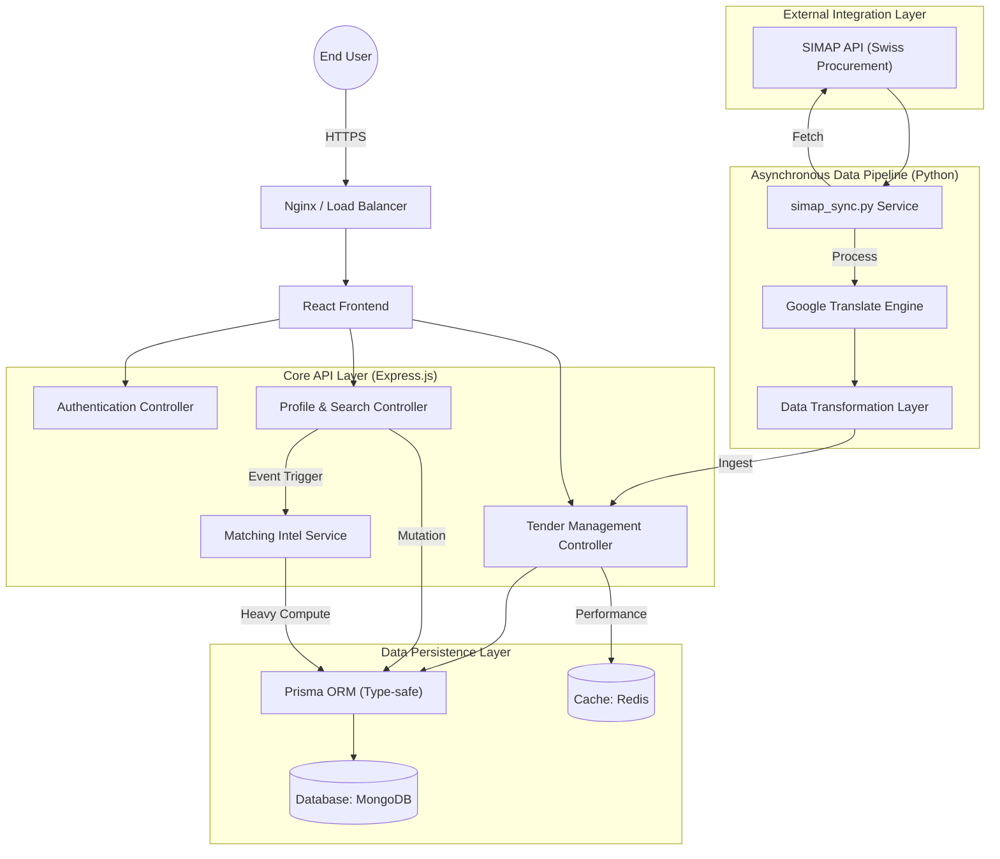

<div align="center">

<br />

```
        ██╗  ██╗   ██╗ ███████╗ ████████╗    ██████╗  ██╗ ██████╗ 
        ██║  ██║   ██║ ██╔════╝ ╚══██╔══╝    ██╔══██╗ ██║ ██╔══██╗
        ██║  ██║   ██║ ███████╗    ██║       ██████╔╝ ██║ ██║  ██║
   ██   ██║  ██║   ██║ ╚════██║    ██║       ██╔══██╗ ██║ ██║  ██║
   ╚█████╔╝  ╚██████╔╝ ███████║    ██║       ██████╔╝ ██║ ██████╔╝
   ╚════╝     ╚═════╝  ╚══════╝    ╚═╝       ╚═════╝  ╚═╝ ╚═════╝ 
```

### Modern Auction & Bidding Intelligence Platform

*Real-time procurement and automated tender synchronization*

<br />


<br />

[Documentation](#getting-started) · [Report Issue](https://github.com/Diyajain3/JustBid/issues) · [Request Feature](https://github.com/Diyajain3/JustBid/issues)

---

</div>

## Table of Contents

- [About The Project](#about-the-project)
- [System Architecture](#system-architecture)
- [Backend Deep Dive](#backend-deep-dive)
    - [Data Synchronization & Ingestion](#data-synchronization--ingestion)
    - [Intelligent Matching Algorithm](#intelligent-matching-algorithm)
    - [Security & Authentication](#security--authentication)
- [Frontend Architecture](#frontend-architecture)
- [Technical Stack](#technical-stack)
- [Project Structure](#project-structure)
- [Getting Started](#getting-started)
- [API Specification](#api-specification)
- [Roadmap](#roadmap)
- [License](#license)

---

## About The Project

JustBid is a sophisticated online auction and bidding platform designed for high-performance tender management. It automates the procurement lifecycle by synchronizing with external tender databases, translating multi-language data into English, and matching opportunities to company profiles using an intelligent scoring engine.

JustBid provides a secure, transparent, and scalable environment for both buyers and sellers to engage in real-time auctions.

---

## System Architecture

The following diagram illustrates the data flow from ingestion to user delivery:



---

## Backend Deep Dive

The JustBid backend is built on a modular Service-Controller pattern using Node.js and Express v5. It is designed for horizontal scalability and high availability.

### Data Synchronization & Ingestion

The system employs a dedicated Python-based worker (`simap_sync.py`) for automated tender acquisition:
1. **Asynchronous Acquisition**: Utilizes `httpx` for high-concurrency requests to SIMAP V1/V2 APIs.
2. **Natural Language Translation**: Automatically detects source languages (German, French, Italian) and translates content to English using an integrated translation engine.
3. **Data Scrubbing & Normalization**: Transforms raw JSON publications into structured objects compatible with our MongoDB schema.
4. **Resilience & State Management**: Implements a checkpointing system via `.sync_state.json` to ensure process continuity after interruptions.
5. **API Ingestion**: Sends sanitized data batches to the `/api/tenders/ingest` endpoint protected by internal worker keys.

### Intelligent Matching Algorithm

At the core of JustBid is the `MatchService`, which computes real-time opportunity scores for companies based on four primary vectors:

| Matching Vector | Weight | Logic Description |
|---|---|---|
| **CPV Identification** | 40% | Exact match across Common Procurement Vocabulary (CPV) codes. |
| **Keyword Relevance** | 40% | Full-text relevance analysis against tender titles and descriptions. |
| **Regional Proximity** | 20% | Location-based matching for regional tenders (Cantons/Cities). |
| **Capacity Management** | Bonus/Penalty | Dynamic penalty if the tender budget exceeds or falls significantly below company thresholds. |

The matching process is asynchronous; updating a company profile triggers a background task that re-evaluates all current tenders without blocking the user session.

### Security & Authentication

- **Identity Provider**: Custom implementation using JWT (Json Web Tokens) and bcrypt for password hashing (12 rounds).
- **Session Security**: Stateless authentication with short-lived access tokens and token-based session recovery.
- **Request Integrity**: Validation middleware using Zod for strict schema enforcement on all incoming payloads.
- **Defense in Depth**: Implementation of Helmet for HTTP security headers and CORS for resource sharing control.

---

## Frontend Architecture

The frontend is a modern React application utilizing a tactical, high-contrast design language.
- **State Management**: Context-based state handling for authentication and user sessions.
- **Routing**: Client-side navigation via React Router with protected route guards.
- **UI Design**: Modern industrial aesthetic using dark glassmorphism and premium CSS animations.
- **API Client**: Axios-based service layer with interceptors for automatic authentication header injection.

---

## Technical Stack

### Backend
- **Runtime**: Node.js (ES Modules)
- **API Framework**: Express.js v5
- **Persistence**: MongoDB via Prisma ORM
- **In-memory Store**: Redis
- **Automation**: Python 3.x (Sync Worker)

### Frontend
- **Library**: React.js
- **Styling**: Vanilla CSS / Tailwind CSS
- **HTTP**: Axios

---

## Project Structure

```text
JustBid/
├── backend/                       # Node.js + Express API Pipeline
│   ├── prisma/                    # Schema definitions and migrations
│   ├── src/
│   │   ├── controllers/           # HTTP Request Handlers
│   │   ├── services/              # Pure Business Logic & Matching engine
│   │   ├── routes/                # Endpoint Definitions
│   │   ├── middlewares/           # Auth & Security Layers
│   │   └── server.js              # Application Entry Point
├── frontend/                      # React SPA
│   ├── src/
│   │   ├── components/            # Reusable UI Modules
│   │   ├── pages/                 # Route Views
│   │   ├── context/               # Global State Providers
│   │   └── services/              # API Integration Layers
└── workers/                       # Python Data Synchronizers
```

---

## Getting Started

### Prerequisites
- Node.js v18.0.0 or higher
- Redis v6.0.0 or higher
- MongoDB instance (Atlas or Local)
- Python 3.8+

### Installation

1. **Clone and Install Backend**
   ```bash
   cd backend
   npm install
   cp .env.example .env
   npm run db:push
   npm run dev
   ```

2. **Clone and Install Frontend**
   ```bash
   cd frontend
   npm install
   npm start
   ```

3. **Initialize Data Sync**
   ```bash
   python simap_sync.py --limit 100
   ```

---

## API Specification

| Endpoint | Method | Component | Authentication |
|---|---|---|---|
| `/api/auth/login` | POST | Authentication | Public |
| `/api/tenders` | GET | Tender Feed | Required |
| `/api/company/profile` | POST | Profile Update | Required |
| `/api/tenders/ingest` | POST | Worker Ingestion | Secret Key |

---

## Roadmap

- [x] Automated SIMAP Data Pipeline
- [x] Intelligent CPV Matching Engine
- [x] Multi-language Translation Support
- [ ] Real-time WebSocket Bid Notifications
- [ ] Predictive Tender Analytics
- [ ] Multi-tenant Enterprise Dashboards

---

## License

Distributed under the MIT License. See `LICENSE` for details.

---

<div align="center">

Distributed by the JustBid Engineering Team

</div>
